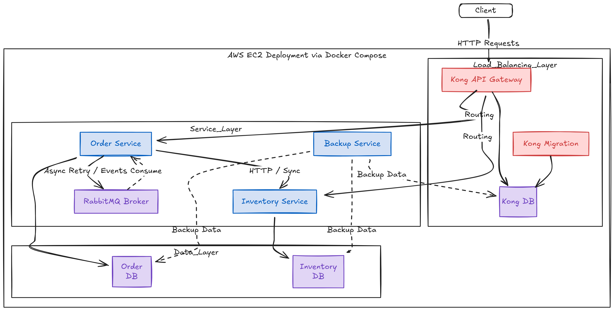

# Microservices E-Commerce System

## 🚀 Project Accomplishments & Requirements Met

We have successfully built and deployed a robust microservices-based e-commerce application with the following key features and engineering standards:

### 1. **Idempotency & Reliability**
- **Server-Side Idempotency**: Implemented using **UUID** and **RabbitMQ**.
- **Mechanism**:
    - Requests generate a unique `idempotencyKey` (e.g., `ORD-123...`).
    - The **Order Service** uses this key to ensure that operations (like shipping orders) are processed exactly once, even in the case of network failures or retries.
    - **RabbitMQ** is used as a reliable message broker to handle retries. If the **Inventory Service** is unavailable or times out, the request is published to a reliable queue (`inventory_exchange`) to be processed asynchronously when the service recovers.

### 2. **CI/CD & Deployment**
- **Continuous Integration (CI)**:
    - Automated GitHub Actions pipeline (`Monorepo CI`).
    - **Unit Tests**: Automatically run `npm test` for every service on pull requests and pushes.
    - **Docker Builds**: Automatically builds and pushes Docker images to Docker Hub for `order-service` and `inventory-service`.
- **Deployment Infrastructure**:
    - **AWS EC2**: Hosted on a live EC2 instance.
    - **SSH Access**: Secure terminal access managed via SSH key pairs.
    - **Docker Compose**: Production deployment (`docker-compose.prod.yml`) orchestrates the entire stack.

### 3. **Architecture & Isolation**
- **Database per Service**: strictly followed the "Database per Service" pattern.
    - `Order Service` -> Owns `order-db`
    - `Inventory Service` -> Owns `inventory-db`
    - `Kong Gateway` -> Owns `kong-db`
- **Containerization**: 100% containerized environment ensuring consistency across Dev, Test, and Prod.

---

## 🏗️ System Architecture

The following diagram illustrates the high-level architecture of our deployed system, highlighting the data flow from the user to the internal services.



---

## 🛠️ Tech Stack

| Component | Technology |
|-----------|------------|
| **Languages** | TypeScript, Node.js |
| **Framework** | Express.js |
| **Databases** | PostgreSQL (v15-alpine) |
| **Message Broker** | RabbitMQ (Management Alpine) |
| **API Gateway** | Kong |
| **Containerization** | Docker, Docker Compose |
| **Infrastructure** | AWS EC2 (Linux) |
| **CI/CD** | GitHub Actions |

## 📂 Service Structure

- **order-service**: Handles order placement, status management, and shipping logic.
- **inventory-service**: Manages product stock and inventory updates.
- **monitoring**: Configurations for system health checks and metrics.

## 🚀 Getting Started

To run the system locally:

1. **Clone the repository**:
   ```bash
   git clone <repo-url>
   cd bcf26-final
   ```

2. **Start the stack**:
   ```bash
   docker-compose up --build -d
   ```

3. **Verify Services**:
   - Kong Gateway: `http://localhost:8000`
   - RabbitMQ Dashboard: `http://localhost:15672` (User/Pass: `admin`/`admin`)
